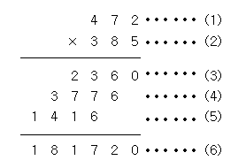

백준 알고리즘 > 단계별로 풀어보기 > 1단계 > 2588번  
<a href="https://www.acmicpc.net/problem/2588">https://www.acmicpc.net/problem/2588</a>  
**문제**  
(세 자리 수) × (세 자리 수)는 다음과 같은 과정을 통하여 이루어진다.



(1)과 (2)위치에 들어갈 세 자리 자연수가 주어질 때 (3), (4), (5), (6)위치에 들어갈 값을 구하는 프로그램을 작성하시오.

**입력**  
첫째 줄에 (1)의 위치에 들어갈 세 자리 자연수가, 둘째 줄에 (2)의 위치에 들어갈 세자리 자연수가 주어진다.

**출력**  
첫째 줄부터 넷째 줄까지 차례대로 (3), (4), (5), (6)에 들어갈 값을 출력한다.

---

**My answer**  


```java
import java.util.Scanner;
public class Main {

	public static void main(String[] args) {
		Scanner scanner = new Scanner(System.in);
		int A, B;
		A = scanner.nextInt();
		B = scanner.nextInt();
		
		System.out.println(A*(B%10));
		System.out.println(A*(B/10%10));
		System.out.println(A*(B/100%10));
		System.out.println(A*(B/100%10)*100 + A*(B/10%10)*10 + A*(B%10));

	}
}


```


